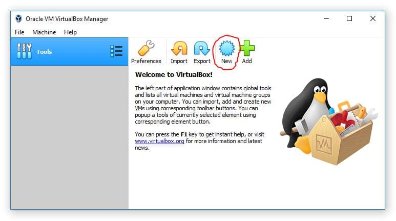

# Setting-up-a-metasploitable-virtual-home-lab

<h2>Download And install Metasploitable</h2>

Metasploitable is an intentionally vulnerable Linux virtual machine. This VM can be used to conduct security training, test security tools, and practice common penetration testing techniques.The first step is to download Metasploitable 2 VM click here.

<h2>Extract the Metasploitable File</h2>

Make sure you extract the metasploitable file which originally comes in a zip file

Right click and extract all

<h2>Open VirtualBox</h2>

On your computer launch virtualbox make sure virtualbox has been installed on your computer if you've not, I have created a guide on how to do that click here (https://github.com/Femi3x/Setting-up-a-virtual-home-lab#).We can do this by clicking the New button within the VirtualBox Manager.

After clicking on new we are going to get a POP up whereby need to create our virtual machine.

Note: name choice be anything of choice, type should be Linux, subtype should be Linux 2.4 and Version should be Linux 2.4(64-bit). After that click finish.

Memory Size

The recommended memory size is 512MB. Always note that the blue notification should never move past the green meters.

Virtual Hard Disk

Now move to storage and choose Existing hard disk note: be careful during this configuration

Configure The Network
Ensure that your network settings are configured appropriately. It's recommended to use NAT or Host-only network settings to keep the VM isolated from public networks, as Metasploitable should never be exposed to untrusted networks.

Add File

Now add and locate the previously extracted metasploitable file. Make sure the file is vmdk file this is very important if not done properly an error will occur.

Start and Running Metasploitable
Now go back to the Virtual machine environment and make sure you click on metasploitable after that click on the start interface.

Metasploitabel Running

After clicking on the start option metasploitable will start running and it’s going to ask you for Administrative credentials which by default is.
Default loggin:msfadmin
Default password:msfadmin

